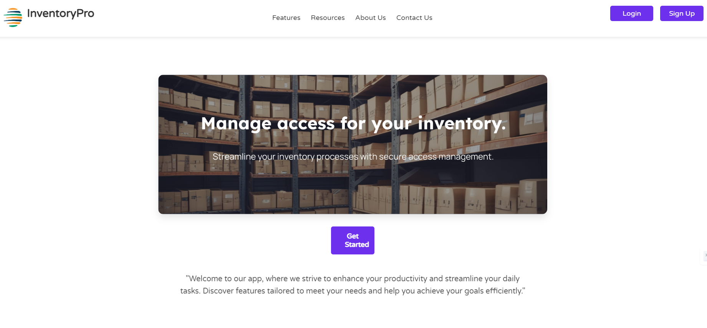
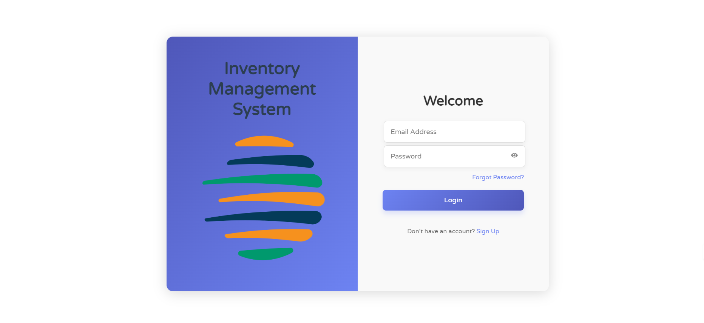
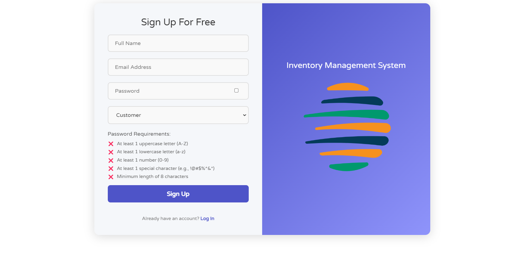
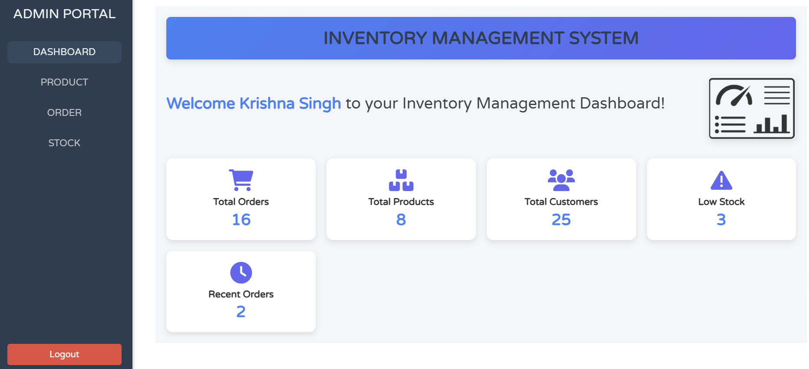
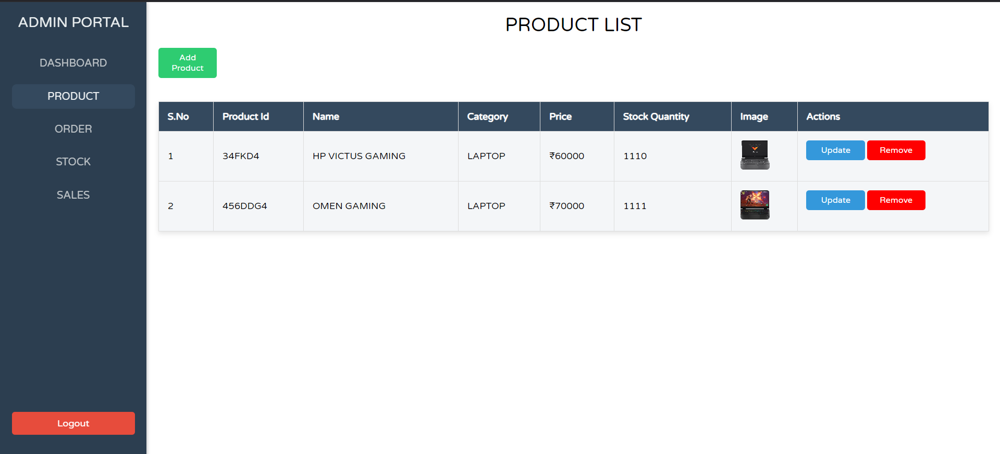
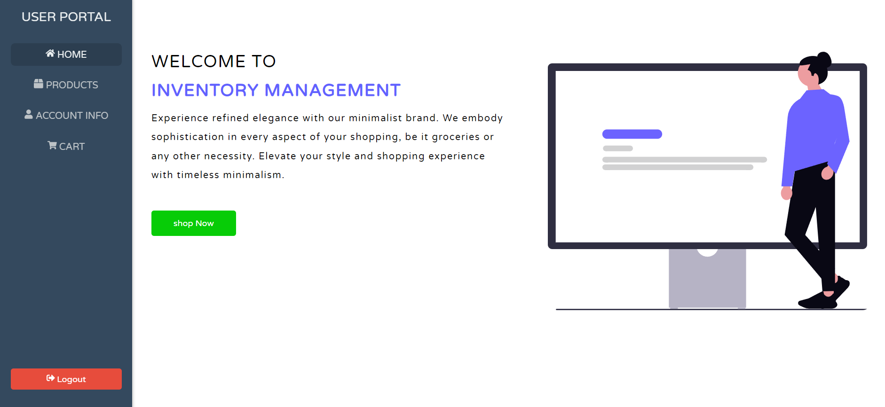
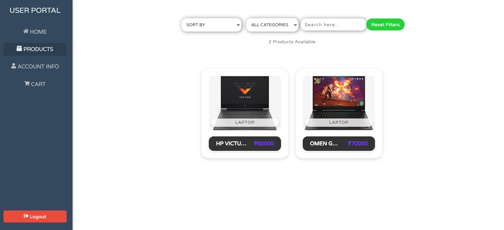

# 📦 Inventory Management System  



### **Manage your inventory effortlessly while providing customers a seamless shopping experience!**  

This **full-stack MERN application** allows businesses to list and manage products and enables customers to browse, shop, and pay—all in one platform.  

---
## 🚀 Links

[](https://inventory-managment-pro.vercel.app/)  
[](https://github.com/singhkrishna01/Inventory_Management/)

## 🚀 Features  

- **Business Management**: Add, update, and manage product details and inventory.  
- **Customer Experience**: Customers can explore products and make purchases easily.  
- **Secure Payment**: Integrated with Razorpay for hassle-free payment processing.  

---

## 🛠️ Technologies  

- **Frontend**: React  
- **Backend**: Node.js & Express  
- **Database**: MongoDB  
- **Authentication**: JSON Web Token (JWT)  
- **Payment Gateway**: Razorpay  

---

## 📂 Project Structure  

```
Inventory_Management/
│
├── Backend_Inventory_Management/   # Server-side code and API routes
│
└── Frontend_Inventory_Managment/   # Client-side React application
    └── public/                     # Contains static assets (e.g., screenshots)
```

---

## 🖼️ Screenshots 

# 📦 Login    


# 📦 Signup  



# 📦 ADMIN DASHBOARD  

### Business Dashboard  


### Products Listing  



# 📦 USER DASHBOARD  

### User Home  


### Product Listing  


---

## ⚙️ Setup & Installation  

Follow these steps to set up the application locally:

### 1. Clone the Repository  

```bash
git clone <repo_url>
cd Inventory_Management
```

### 2. Install Dependencies  

#### Frontend  

```bash
cd Frontend_Inventory_Managment
npm install
```

#### Backend  

```bash
cd Backend_Inventory_Management
npm install
```

### 3. Configure Environment Variables  

#### Frontend `.env`  

Create a `.env` file in the `Frontend_Inventory_Managment` directory and add:  

```env
RZP_KEY_ID=your_key
```

#### Backend `.env`  

Create a `.env` file in the `Backend_Inventory_Management` directory and add:  

```env
PORT=3000
MONGO_URI=your_db_uri
API_VARI=your_api_variant
PASS=your_app_id
JWT_SECRET=your_jwt_secret
EMAIL=your_email
RZP_KEY_ID=your_key_id
RZR_KEY_SECRET=your_key_secret
```

Replace placeholders (`your_key`, `your_db_uri`, etc.) with actual credentials.  

---

### 4. Run the Application  

#### Backend  

```bash
cd Backend_Inventory_Management
npm start
```

#### Frontend  

Open a new terminal and run:  

```bash
cd Frontend_Inventory_Managment
npm start
```

Access the application at `http://localhost:3000`.  

---

## 📋 API Documentation  

### Example Endpoints  

- **POST** `/api/products`: Add a new product to the inventory.  
- **GET** `/api/products`: Fetch all available products.  
- **POST** `/api/payment`: Handle customer payments.  

For more details, refer to the backend code.  

---

## 🤝 Contributing  

We welcome contributions!  

1. Fork the repository.  
2. Create a feature branch.  
3. Submit a pull request.  

---